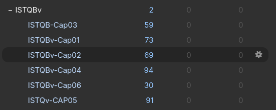

# 📚 ISTQB Study Resources

<p align="center">
  
</p>

<p align="center">
  <strong>Mazo de Anki para estudiar ISTQB Foundation Level v4.0</strong>
</p>

<p align="center">

Aprende los fundamentos de <strong>ISTQB Foundation Level v4.0</strong> mediante tarjetas diseñadas para reforzar el aprendizaje con <strong>Spaced Repetition (Repetición Espaciada)</strong>, priorizando la comprensión y aplicación de los conceptos en escenarios reales de testing.

</p>

---

# 📖 Descripción

Este repositorio contiene un mazo de **Anki** que elaboré durante mi preparación para la certificación **ISTQB Foundation Level v4.0**.

A diferencia de otros recursos enfocados únicamente en memorizar definiciones, este mazo busca ayudar a comprender **cómo aplicar los conceptos de ISTQB en el trabajo diario de un QA**.

Muchas de las tarjetas fueron redactadas con mis propias palabras y complementadas con preguntas que buscan desarrollar el razonamiento detrás de cada concepto, respondiendo preguntas como:

- ¿Cuándo utilizar esta técnica?
- ¿Por qué es la mejor opción en determinado escenario?
- ¿Cómo se aplica durante el diseño de pruebas?
- ¿Qué problema intenta resolver?

El objetivo no es memorizar el syllabus palabra por palabra, sino desarrollar el criterio necesario para diseñar mejores pruebas, entender los fundamentos del testing y conectar la teoría con situaciones reales que pueden presentarse durante un proyecto.

---

# 🎯 Objetivos del mazo

Este material está pensado para ayudarte a:

- 📚 Repasar los conceptos fundamentales de ISTQB Foundation Level.
- 🧠 Reforzar el aprendizaje mediante **Spaced Repetition**.
- 💡 Comprender cuándo y cómo aplicar las técnicas de testing.
- 📝 Relacionar la teoría con escenarios reales de pruebas.
- 🚀 Prepararte para la certificación mientras desarrollas un criterio práctico como QA.

---

# 📂 Contenido

Actualmente el mazo incluye tarjetas correspondientes a los siguientes capítulos:

- ✅ Capítulo 1 - Fundamentos del Testing
- ✅ Capítulo 2 - Testing durante el Ciclo de Vida del Software
- ✅ Capítulo 3 - Testing Estático
- ✅ Capítulo 4 - Análisis y Diseño de Pruebas
- ✅ Capítulo 5 - Gestión de las Actividades de Testing
- ✅ Capítulo 6 - Herramientas de Testing

Las tarjetas se encuentran organizadas por capítulos para facilitar el estudio progresivo.

---

# 🚀 ¿Cómo utilizar el mazo?

1. Instala **Anki**.
2. Descarga el archivo `.apkg` ubicado en la carpeta `deck/`.
3. Abre Anki.
4. Selecciona:

```text
Archivo → Importar
```

5. Importa el archivo del mazo.
6. Estudia cada capítulo utilizando la repetición espaciada.

---

# 📷 Vista previa

<p align="center">
  
</p>

---

# 🤝 Contribuciones

Si encuentras algún error, deseas mejorar alguna explicación o agregar nuevas tarjetas, eres bienvenido a colaborar.

Puedes hacerlo mediante:

- 🐞 Issues
- 🔀 Pull Requests

Toda contribución es bienvenida.

---

# ⚠️ Aviso

Este proyecto fue creado únicamente con fines educativos.

No está afiliado, patrocinado ni certificado por **ISTQB®**.

Las tarjetas **no son una copia textual del syllabus**, ni representan preguntas oficiales del examen.

El contenido fue elaborado como material de estudio inspirado en los temas de **ISTQB Foundation Level v4.0**, priorizando la comprensión práctica, el razonamiento y la aplicación de los conceptos por encima de la memorización de definiciones.

Se recomienda complementar este recurso con el estudio del syllabus oficial y otras fuentes de aprendizaje.

---

# ⭐ Apoya el proyecto

Si este repositorio te resultó útil durante tu preparación para ISTQB, considera darle una ⭐.

También puedes compartirlo con otras personas que estén iniciando en el mundo del Testing y quieran aprender no solo la teoría, sino también **cómo aplicar los fundamentos de ISTQB en proyectos reales**.

¡Espero que este recurso pueda ayudarte tanto como me ayudó a mí durante mi preparación! 🚀
